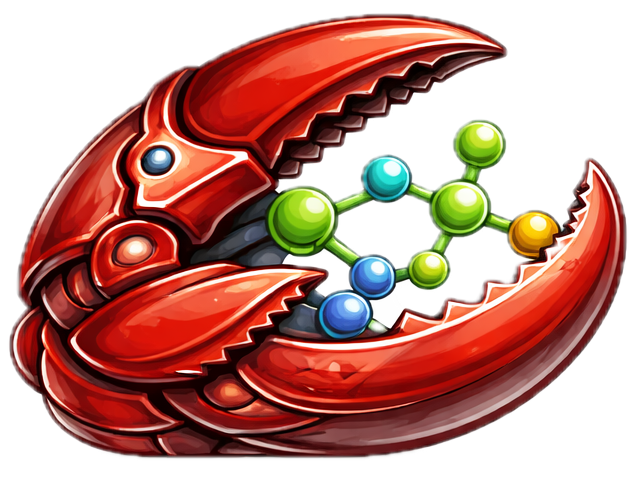
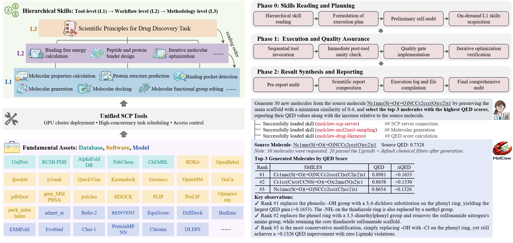
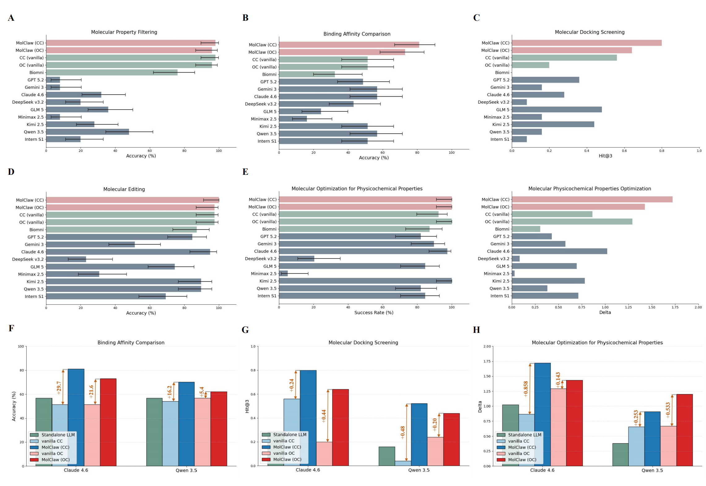

<a id="top"></a>

#  MolClaw: An Autonomous Agent with Hierarchical Skills for Drug Molecule Evaluation, Screening, and Optimization

<div align="center">

<!-- [](https://www.biorxiv.org/content/10.64898/2026.04.03.716272v1) -->
[](https://arxiv.org/abs/2604.21937)
[](./LICENSE)
[](https://www.python.org/downloads/)

**A reproducible pathway for autonomous molecular evaluation, screening, and optimization.**

✨ If MolClaw helps your research or engineering workflow, we'd really appreciate a star.

</div>

---

## 📖 Overview

Computational drug discovery is fundamentally a **long-horizon workflow orchestration problem**: each decision depends on upstream tool outputs, scientific constraints, and strict quality verification. MolClaw is designed for this setting as a practical and reproducible framework for **molecule evaluation, screening, and optimization**.

This open-source release combines a benchmark suite, a hierarchical skill library, and runnable inference/evaluation pipelines:

- **Hierarchical skill architecture (`L1`/`L2`/`L3`)** that separates atomic tool operations, workflow composition, and methodology-level scientific governance.
- **Model- and runtime-agnostic design philosophy**: skill definitions are intended to remain stable as backbone models and agent runtimes evolve.
- **Unified benchmark stack (`molbench`)** covering molecular screening and molecular optimization settings under standardized evaluation protocols.
- **Runnable execution pipelines in `molclaw_run`** for direct baseline LLM inference and Claude Code skill-driven execution.

<div align="center">
  
</div>

---

## 📊 MolBench

`molbench` is a **multi-dimensional benchmark suite for drug discovery agents**, designed to evaluate not only final answers but also the reliability of structured, tool-augmented scientific workflows.

- **`molbench-ms-1`**: molecular property filtering.
- **`molbench-ms-2`**: target-aware binding-affinity comparison QA.
- **`molbench-ms-3`**: virtual-screening style ranking and hit identification.
- **`molbench-mo`**: molecule optimization tasks, including editing and physicochemical optimization tracks.

`molbench/eval` contains unified evaluators (`eval_runner.py`, `run_eval_bench.py`) together with ChemCoTBench-related evaluation dependencies, enabling **comparable cross-run analysis** under one consistent evaluation interface.

<div align="center">
  
</div>

---

## 🤖 Skills

`skills/` is the reusable skill library for agent execution and workflow standardization:

- **`skills/L1_tools`**: tool-level operation skills (atomic actions, interface conventions, output checks).
- **`skills/L2_workflows`**: multi-step workflow skills (task decomposition, step ordering, failure recovery).
- **`skills/L3_methodology`**: high-level scientific methodology and governance principles.
- **`skills/LR_research`**: literature review and research-related skills.
- **`skills/auto-generated-skills`**: skills automatically generated during agent execution.
- **`skills/system_prompt`**: system prompts defining the agent's core behavior.

This hierarchy is built to be **modular, composable, and auditable**, so complex workflows remain maintainable as tasks, tools, and model backbones evolve.

For Claude Code usage, copy skills into your task workspace:

```bash
mkdir -p ./.claude/skills
cp -R <YOUR_CLONED_MOLCLAW_DIR>/skills/* ./.claude/skills/
```

---

## 🚀 Quick Start

### 1) Clone Repository and Create Conda Environment

```bash
git clone https://github.com/InternScience/MolClaw.git
cd MolClaw
conda env create -f environment.yaml
conda activate molclaw
```

This environment is the recommended baseline for `molbench` inference and evaluation dependencies.

### 2) Configure Environment

```bash
cp .env.template .env
# edit .env and fill required keys/endpoints for your model provider

# load env vars into current shell
set -a
source .env
set +a
```

### 3) Claude Code Interact with Skills

Copy the Skills into your Claude Code workspace and then you can interact with them in your conversations.

```bash
# in your task workspace
mkdir -p ./.claude/skills
cp -R <YOUR_CLONED_MOLCLAW_DIR>/skills/* ./.claude/skills/

claude
# then run /init and ask your task
```

### 4) Benchmark Runs

Use the commands below for baseline and Claude benchmark runs; each command performs inference and automatic `molbench` evaluation.

```bash
# Baseline benchmark run (direct LLM inference + auto evaluation)
bash molclaw_run/infer/baselines/launch_baseline.sh --cfg config/baseline_molbench-ms-1.yaml

# Claude benchmark run (Claude Code workflow + auto evaluation)
bash molclaw_run/infer/claude_agent/launch_claude.sh --cfg config/claude_template.yaml --claude-mode both
```

You can switch datasets/tasks by replacing the config file with other templates in `config/`.

### 5) Evaluate an Existing Run Directory

If you have an existing run directory with generated outputs and want to evaluate it under `molbench` protocols, you can use the unified evaluation script:

```bash
python molbench/eval/run_eval_bench.py <RESULTS_DIR> --cfg <CONFIG_PATH>
```

---

## 📄 License

This project is licensed under the MIT License - see the `LICENSE` file for details.

---

## 📝 Citation

If you use MolClaw in your research or projects, please consider citing our paper:

```bibtex
@article{zhang2026molclaw,
  title={MolClaw: An Autonomous Agent with Hierarchical Skills for Drug Molecule Evaluation, Screening, and Optimization},
  author={Zhang, Lisheng and Wang, Lilong and Sun, Xiangyu and Tang, Wei and Su, Haoyang and Qian, Yuehui and Yang, Qikui and Li, Qingsong and Tang, Zhenyu and Sun, Haoran and others},
  journal={arXiv preprint arXiv:2604.21937},
  year={2026}
}
}
```
---

<div align="center">

**Made with ❤️ by the MolClaw Team**

[GitHub: InternScience/MolClaw](https://github.com/InternScience/MolClaw) • [⬆ back to top](#top)

</div>
